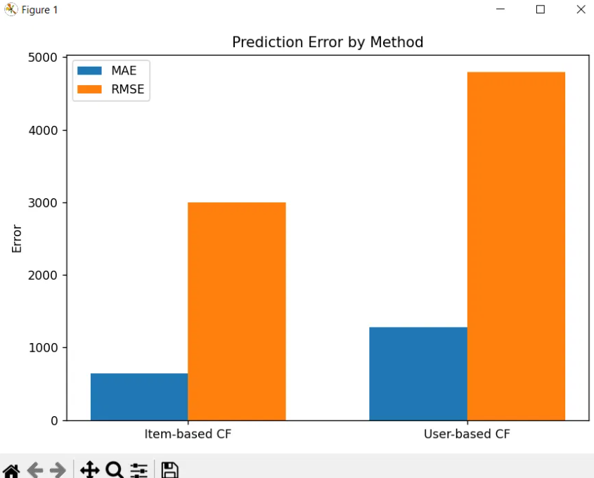
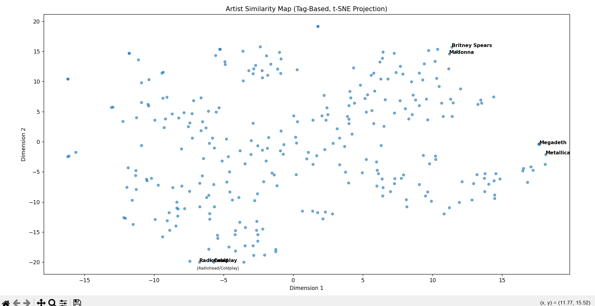

# hybrid recommender system
Hybrid music artist recommender using item-based and user-based collaborative filtering plus content-based tag similarity — built on the Last.fm HetRec 2011 dataset.

# Music Artist Recommendation System

A hybrid music recommendation system built on the [Last.fm HetRec 2011 dataset](https://grouplens.org/datasets/hetrec-2011/), implementing three complementary approaches:

| Approach | Technique | Signal used |
|----------|-----------|-------------|
| Item-based CF | Cosine similarity between artists | Play counts |
| User-based CF | Cosine similarity between users | Play counts |
| Content-based | Cosine similarity between artists | Crowd-sourced genre tags |

---

## Dataset

**HetRec 2011 — Last.fm** (publicly available, no account required)  
Download: https://grouplens.org/datasets/hetrec-2011/

### Setup steps

1. Download the dataset from the link above and unzip it
2. Inside this project folder, create a new folder called `data`
3. Copy these 6 files from the unzipped download into that `data` folder:

```
artists.dat
user_artists.dat
tags.dat
user_taggedartists.dat
user_taggedartists-timestamps.dat
user_friends.dat
```

Your folder structure should look like this:

```
hybrid-recommender-system/
    hybrid_recommender_complete.py
    README.md
    data/
        artists.dat
        user_artists.dat
        tags.dat
        user_taggedartists.dat
        user_taggedartists-timestamps.dat
        user_friends.dat
```

> **Note:** the `data/` folder is not included on GitHub — the dataset belongs to GroupLens and should be downloaded directly from their site using the link above.

The dataset covers ~1,900 users, ~17,600 artists, and ~186,000 user-artist interactions.

---

## Methodology

### Collaborative Filtering

Both item-based and user-based approaches use a **user-item matrix** where rows are users, columns are artists, and values are play counts (a proxy for preference strength).

**Item-based CF:** Transposes the matrix and computes pairwise cosine similarity between artists. To recommend for a user, it scores unseen artists as a weighted sum of their similarity to already-played artists, weighted by the user's play counts.

**User-based CF:** Computes pairwise cosine similarity between users directly. Recommendations come from the top-K most similar users' listening history, filtered to exclude artists the target user already knows.

### Content-Based Filtering

Builds an **artist-tag matrix** from crowd-sourced Last.fm tags (e.g. "alternative rock", "80s", "female vocalist") and computes cosine similarity between artists' tag profiles. This approach is complementary to CF — it works even when play-count data is sparse, and it groups artists by musical character rather than listener overlap.

### Evaluation

Predictions are evaluated on a 25% held-out test set using **MAE** and **RMSE** on predicted play counts.



Item-based CF outperforms user-based CF on both metrics, suggesting artist-artist similarity is a more stable signal than user-user similarity for this dataset.

### Explainability

Both CF methods include explanation functions that show *why* a recommendation was made:
- Item-based: lists the bridge artists (played by the user) that are most similar to the recommended one
- User-based: lists similar users who listened to the recommended artist and the common artists that make them similar

---

## Project Structure

```
hybrid-recommender-system/
    hybrid_recommender_complete.py   # Main script (run top to bottom)
    README.md
    data/                             # Download separately — see Dataset section above
```

---

## Requirements

```
python >= 3.8
pandas
numpy
scikit-learn
matplotlib
seaborn
```

Install with:

```bash
pip install pandas numpy scikit-learn matplotlib seaborn
```

---

## Running the Script

```bash
python hybrid_recommender_complete.py
```

Or open in VS Code and run directly. No Google account required — all paths are local.

> **Note on performance:** the script filters to artists with at least 20 listeners early on, which keeps the similarity matrices manageable even on lower-RAM machines (tested working on 4GB RAM). If you still hit memory issues, increase `min_users` (e.g. to 50) to shrink the matrices further.

---

## Key Results

- Cosine similarity successfully clusters artists by genre (e.g. Metallica → Machine Head, Kreator; Radiohead → Thom Yorke, Pixies)
- Tag-based similarity produces genre-coherent playlists even for niche artists with limited play-count data (e.g. Metallica → Megadeth, Anthrax)
- Cold-start users (no listening history) cannot be served by CF; content-based filtering provides a fallback

### Artist Similarity Map

A 2D projection (PCA + t-SNE) of the top 300 most-tagged artists based on their tag similarity. Artists with similar genres cluster together — metal artists (Metallica, Megadeth) group distinctly from pop artists (Britney Spears, Madonna) and indie/alternative artists (Radiohead, Coldplay).



---

## Project Context

Built as a final project for an Artificial Intelligence course, exploring collaborative and content-based filtering techniques on a real-world music dataset.
